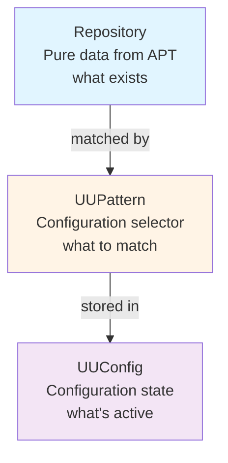
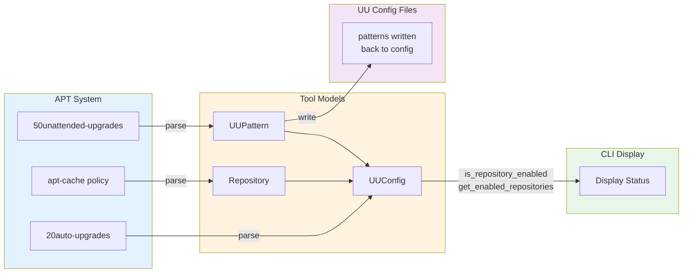

# Architecture

## Overview

`apt-uu-config` is a CLI tool for managing unattended-upgrades configuration. The architecture follows a clean separation of concerns with three distinct layers:

1. **Model Layer** - Data models and business logic
2. **Data Layer** - APT and configuration file parsers (to be implemented)
3. **CLI Layer** - User interface commands (to be implemented)

## Design Principles

### Separation of Data from Configuration

The core architectural insight is distinguishing between:

- **Repositories** - What exists on the system (data from APT)
- **Patterns** - What to match (selectors/filters)
- **Configuration** - Current state (which patterns are active)

This prevents data duplication and creates a clean, understandable model.

## Model Layer

### Core Models

#### `Repository`

Pure data model representing an APT repository as it exists on the system.

**Purpose**: Hold repository metadata from `apt-cache policy`

**Fields**:
- `origin` - Repository provider (e.g., "Ubuntu", "Brave Software")
- `suite` - Release channel (e.g., "stable", "noble-security")
- `codename` - Distribution release (e.g., "noble", "jammy")
- `label` - Repository label
- `component` - Licensing subdivision (e.g., "main", "universe")
- `site` - Repository hostname
- `priority` - APT priority number
- `url` - Full package list URL
- `architecture` - System architecture (e.g., "amd64")
- `version` - Distribution version

**Key Properties**:
- No business logic about unattended-upgrades
- No "enabled" flag - that's configuration state, not repository data
- Immutable representation of what APT sees

**Example**:
```python
repo = Repository(
    origin="Ubuntu",
    suite="noble-security",
    codename="noble",
    site="security.ubuntu.com",
    priority=500,
    url="http://security.ubuntu.com/ubuntu noble-security/main amd64 Packages"
)
```

#### `UUPattern`

Represents a pattern that matches repositories for unattended-upgrades.

**Purpose**: Configuration selector/filter, not a repository

**Fields**:
- `pattern_string` - The pattern as written in config (e.g., "Ubuntu:noble-security")
- `section` - "Allowed-Origins" or "Origins-Pattern"

**Key Methods**:
- `matches(repo: Repository) -> bool` - Check if pattern matches a repository
- `suggest_for_repository(repo: Repository) -> UUPattern` - Suggest best pattern for a repo

**Pattern Formats Supported**:

1. **Simple colon format** (Allowed-Origins):
   - `"Ubuntu:noble-security"`
   - `"Brave Software:stable"`

2. **Explicit key=value** (both sections):
   - `"origin=Ubuntu,suite=noble-security"`
   - `"origin=Tailscale,site=pkgs.tailscale.com"`

3. **Wildcards**:
   - `"Ubuntu:*-security"` (all Ubuntu security repos)
   - `"*-security"` (all security repos)
   - `"origin=*"` (everything - use with caution)

**Pattern Suggestion Logic**:

When suggesting patterns for a repository, uses this priority:

1. Simple `"origin:suite"` if both exist and suite is meaningful
2. `"origin=X,codename=Y"` if origin exists but no suite
3. `"origin=X,site=Y"` if origin and site available
4. `"site=hostname"` as fallback for minimal metadata

This handles repositories with non-standard metadata (e.g., Tailscale has no suite field).

**Example**:
```python
pattern = UUPattern(
    pattern_string="Ubuntu:noble-security",
    section="Allowed-Origins"
)

if pattern.matches(repo):
    print("Repository matches pattern")
```

#### `UUConfig`

Represents the complete unattended-upgrades configuration state.

**Purpose**: Answer "what's enabled?" by matching patterns against repositories

**Fields**:
- `globally_enabled` - Is UU enabled at all? (from 20auto-upgrades)
- `patterns` - List of active patterns (from 50unattended-upgrades)

**Key Methods**:
- `is_repository_enabled(repo: Repository) -> bool` - Check if specific repo is enabled
- `get_enabled_repositories(repos: List[Repository]) -> List[Repository]` - Filter enabled repos
- `add_pattern(pattern: UUPattern)` - Add pattern to config
- `remove_pattern(pattern: UUPattern)` - Remove pattern from config
- `get_patterns_for_section(section: str)` - Get patterns by section

**Key Properties**:
- Does NOT store repository data
- Repositories passed as arguments to query methods
- One pattern can match multiple repositories
- One repository can match multiple patterns

**Example**:
```python
config = UUConfig(
    globally_enabled=True,
    patterns=[
        UUPattern("Ubuntu:noble-security", "Allowed-Origins"),
        UUPattern("Brave Software:stable", "Allowed-Origins")
    ]
)

# Query against actual repositories
all_repos = parse_apt_policy()
enabled_repos = config.get_enabled_repositories(all_repos)
```

### Relationships



### Data Flow



## Data Layer (To Be Implemented)

### APT Parsers

- Parse `apt-cache policy` output → `List[Repository]`
- Extract repository metadata from Release file fields

### Configuration Parsers

- Parse `/etc/apt/apt.conf.d/20auto-upgrades` → `globally_enabled` flag
- Parse `/etc/apt/apt.conf.d/50unattended-upgrades` → `List[UUPattern]`
- Handle variable substitution (`${distro_id}`, `${distro_codename}`)

### Configuration Writers

- Write `UUConfig` back to configuration files
- Create automatic backups before modifications
- Validate configuration syntax

## CLI Layer (To Be Implemented)

### Commands

- `status` - Show current configuration and repository states
- `enable` / `disable` - Control global UU state
- `origin enable <pattern>` - Add pattern to config
- `origin disable <pattern>` - Remove pattern from config
- `origin suggest <repo>` - Suggest pattern for repository

### Display Logic

- Format repositories in tables
- Show enabled/disabled status
- Highlight pattern matches

## File Structure

```
apt_uu_config/
├── models/
│   ├── __init__.py
│   ├── repository.py       # Repository model
│   ├── uu_pattern.py       # UUPattern model
│   └── uu_config.py        # UUConfig model
├── apt/                    # (to be implemented)
│   ├── policy_parser.py    # Parse apt-cache policy
│   └── config_parser.py    # Parse UU config files
├── cli/                    # (to be implemented)
│   ├── status.py
│   ├── enable.py
│   └── origin.py
└── config/
    └── app_config.py
```

## Testing Strategy

- **Model Layer**: Unit tests with 93-100% coverage ✅
- **Data Layer**: Parser tests with fixtures
- **CLI Layer**: Integration tests with mocked file system

## Design Benefits

### No Data Duplication

Repository metadata stored once in `Repository` model. Configuration state stored separately in `UUConfig` with patterns.

### Clear Separation of Concerns

- **Repository** = Data (what exists)
- **UUPattern** = Selector (what to match)
- **UUConfig** = State (what's active)

### Correct Relationships

- One pattern can match many repositories ✓
- One repository can match many patterns ✓
- No "enabled_for_uu" flag polluting repository data ✓

### Matches Reality

- APT stores repositories with metadata → `Repository`
- UU config stores patterns → `UUPattern`
- Tool manages state → `UUConfig`