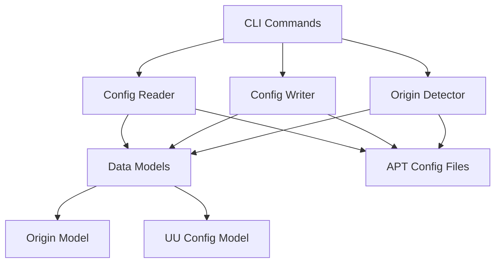
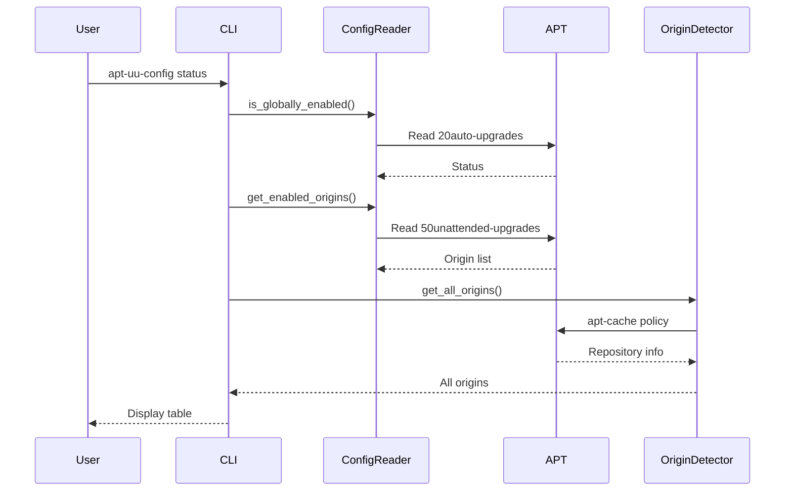

# Architecture

## Overview

apt-uu-config is structured in three main layers:

1. **CLI Layer** - Command-line interface using Click
2. **Business Logic Layer** - APT configuration management
3. **Data Layer** - Models and configuration readers/writers

## Component Diagram

## Key Components

### CLI Commands

- **status**: Display current configuration and repository list
- **enable/disable**: Toggle unattended upgrades globally
- **origin enable/disable**: Manage per-repository settings

### APT Module

- **ConfigReader**: Reads APT configuration files
  - `/etc/apt/apt.conf.d/20auto-upgrades`
  - `/etc/apt/apt.conf.d/50unattended-upgrades`

- **ConfigWriter**: Writes APT configuration with backups
  - Creates `.bak` files before modifications
  - Validates configuration syntax

- **OriginDetector**: Discovers available repositories
  - Parses `apt-cache policy` output
  - Reads `/var/lib/apt/lists/` Release files

- **SourcesParser**: Parses sources.list files
  - `/etc/apt/sources.list`
  - `/etc/apt/sources.list.d/*.list`

### Models

- **Origin**: Represents a repository origin
  - Includes origin name, suite, codename
  - Pattern matching for wildcards

- **UnattendedUpgradesConfig**: Configuration state
  - Global enabled/disabled status
  - List of enabled origins

## Configuration Flow

